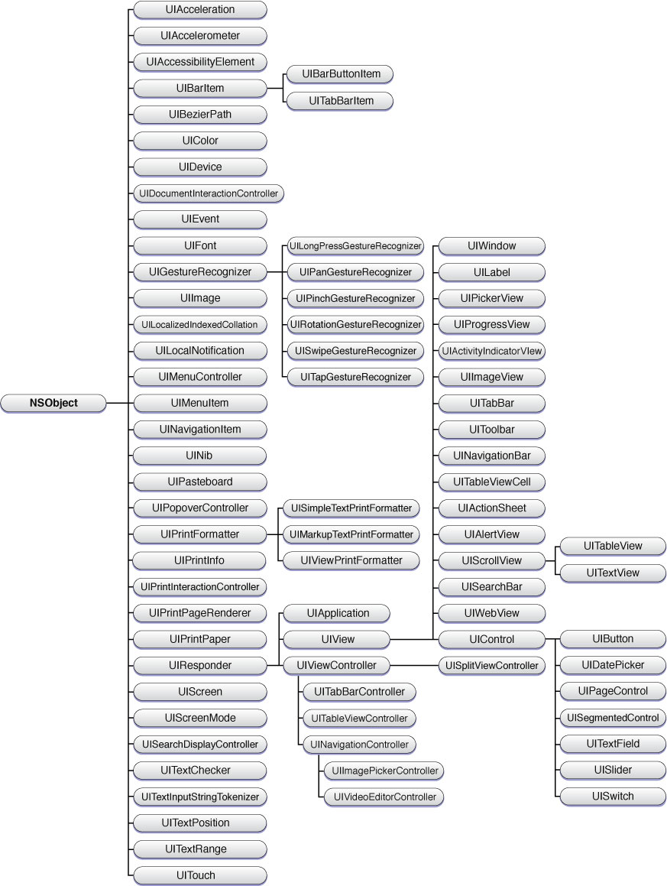

## UIKit

### Construct
#### The UIKit overview from this [blog](https://finalize.com/2012/12/14/uikit-class-hierarchy-chart/).

* UISwitch
--- Using `sender.isOn` determine whether to switch
* UISegmentControl
--- Using `sender.selectedSegmentIndex` to confirm which one the user clicked
* UISlider
--- Using `sender.value` to confirm which value the user adjusts.
